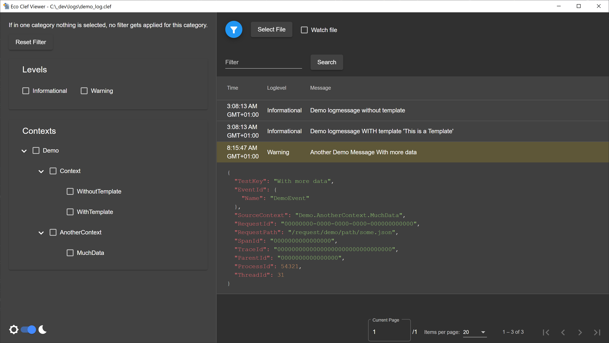

# Eco Clef Viewer
A simple logviewer to view, search and filter logfiles in the [CLEF Format](https://clef-json.org/).

## Features
- Using the "@l" property to highlight "Warning" and "Error" loglevels
  - Filter also uses this property so you can filter by loglevel
- Parsing the "@mt" property to correctly display the logmessage
  - If the logmessage contains a linebreak only the first line is displayed. The rest of the message is visible when expanding the message.
- Using the "SourceContext" property to build the tree for filtering. (Source context is expected to be dot seperated: "Example.Source.Context")
- Darkmode!
- Watchmode
  - Can be enabled after selecting a file
  - Automatically jumps to the end to the logfile, waits for changes and displays them if any occur.

BEWARE! The selected file will be completely stored in your memory. So depending on your memory size, be careful!

## Development
Here are the npm commands you can use while developing, just use `npm run <command>`:
- start: simply starts the angular web app without the electron part
- build: builds the angular frontend
- electron:build: builds the angular frontend, and electron application and runs it
- electron:nobuild: only builds the electon application and runs it without building the frontend again
- dist:windows: builds the windows binaries
- dist:linux: builds the linux binaries
- dist: build the windows and linux binaries